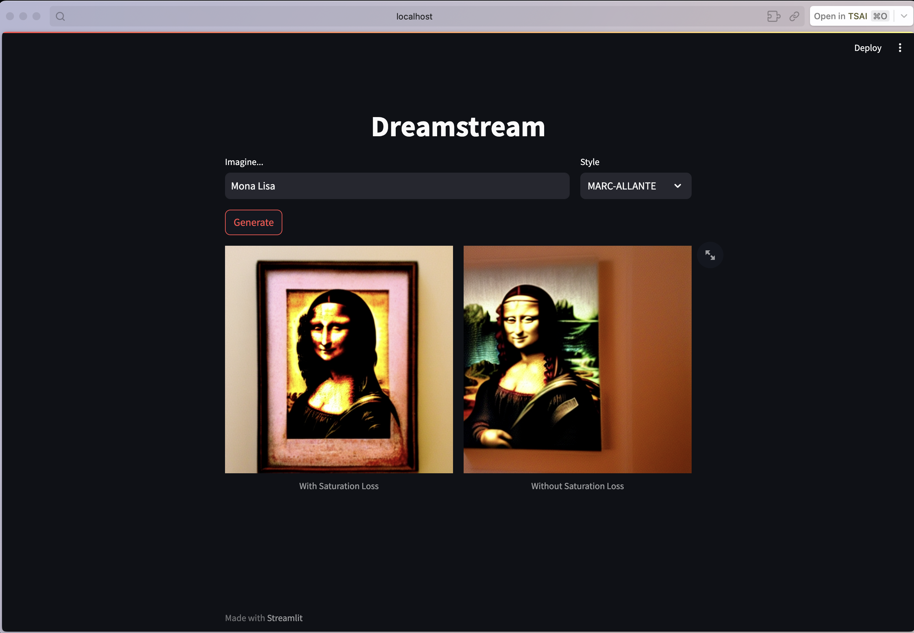

# Dreamstream

This project uses [Hugging Face's](https://huggingface.co/) models and Stable Diffusion to generate images based on a user's input and selected style.

## Overview

- The app prompts the user to input text using the Streamlit interface.
- The user can then select a style from predefined options.
- Based on the input and selected style, the app generates two images:
  - One with saturation loss.
  - One without saturation loss.

## Installation & Usage

1. Clone this repository:
2. `pip install -r requirements.txt`
3. `streamlit run app.py`

## Available Styles
The available styles for image generation are:
- MIDJOURNEY-STYLE
- FAIRY-TALE
- ILLUSTRATION
- KUVSHINOV
- MARC-ALLANTE

## Configuration
Styles and their respective embeddings can be configured in config.py.
