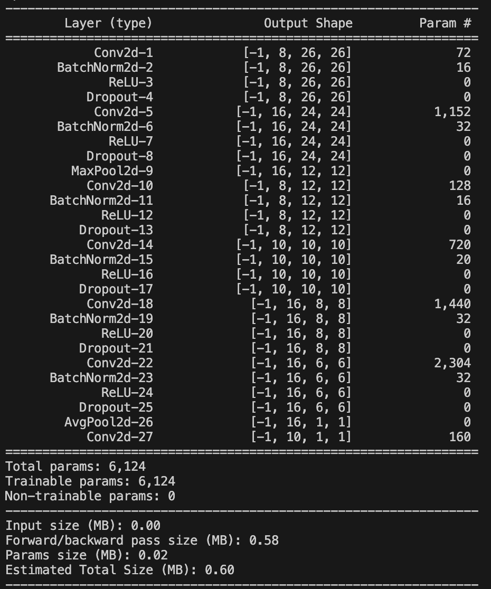
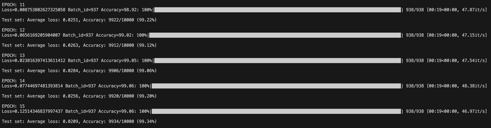
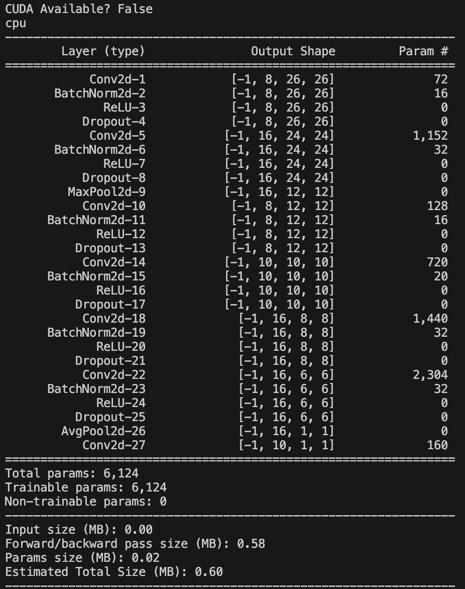
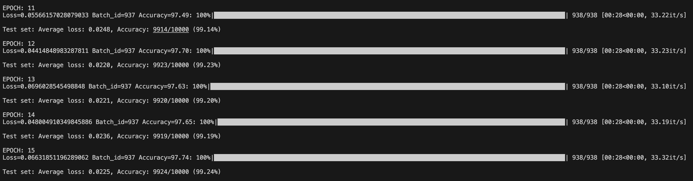
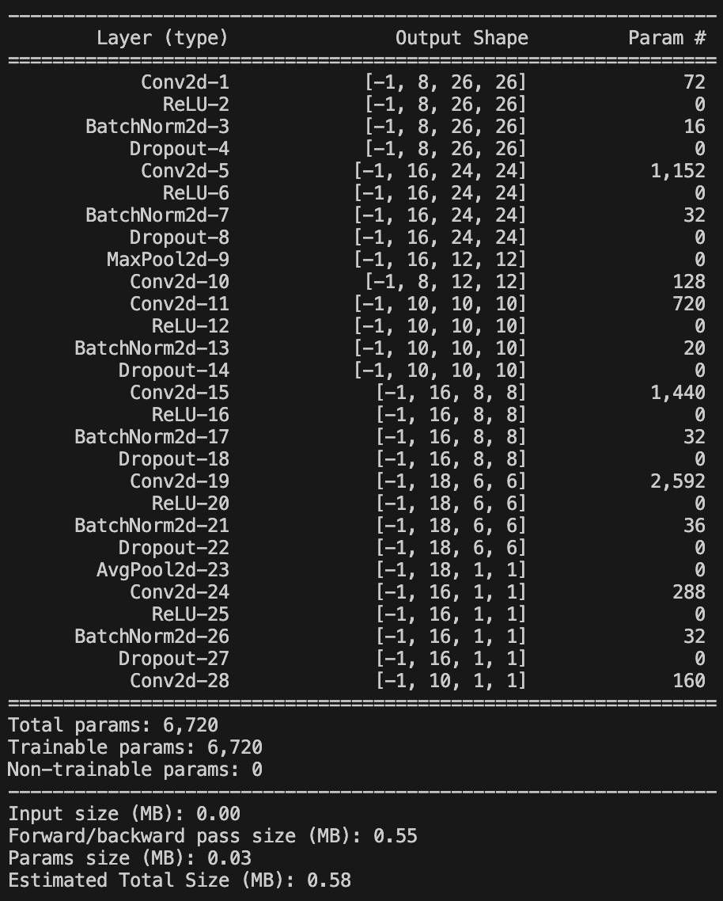
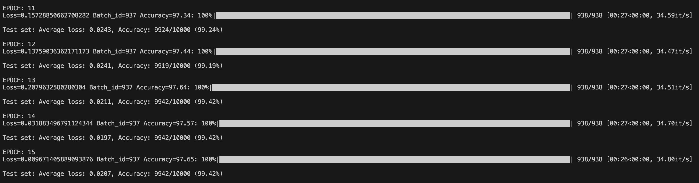

# SESSION-7 In Depth Coding Practices

## Model-1: Getting the model skelatal right

* <strong>Target</strong>:

Get a basic skelatal of model that has no more than 8000 parameters.

* <b>Result</b>
1. Parameters: 6,124
2. Best Training Accuracy: 99.06%
3. Best Test Accuracy: 99.34%

* <b>Analysis</b>
1. There is no overfitting rather a bit underfitting, that's fine dropout is doing its work because we are adding dropout at each layer the model is able to capture the training accuracy.
2. However, we haven't reached 99.4 accuracy yet.

## Model-2: Image Augmentation

* <strong>Target</strong>:

Add various Image augmentation techniques, image rotation, randomaffine, colorjitter.

* <b>Result</b>
1. Parameters: 6124
2. Best Training Accuracy: 97.74%
3. Best Test Accuracy: 99.24%

* <b>Analysis</b>
1. The model is underfitting, that should be ok as we know we have made our train data harder.
2. However, we haven't reached 99.4 accuracy yet.
3. The model seems to be stuck at 99.2% accuracy, seems like the model needs some additional capacity towards the end.

## Model-3: LR Schedular

* <strong>Target</strong>:

Add some capacity (additional FC layer after GAP) to the model and added LR Scheduler.

* <b>Analysis</b>
1. Parameters: 6720
2. Best Training Accuracy: 97.65%
3. Best Test Accuracy: 99.42%

* <b>Analysis</b>
1. The model parameters have increased
2. The model is under-fitting. This is fine, as we know we have made our train data harder.
3. LR Scheduler and the additional capacity after GAP helped getting to the desired target 99.4, Onecyclic LR is being used, this seemed to perform better than StepLR to achieve consistent accuracy in last few layers